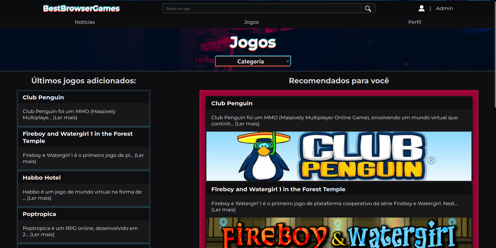

# BestBrowserGames - Projeto Final <Primeiro Código />

Resolução do projeto final "BestBrowserGames" do programa <Primeiro Código /> da Ada Tech.

[Link para o deploy do frontend](https://adafinal-frontend.vercel.app/)  
[Link para o backend](https://github.com/IMenezes-GH/Adafinal-backend)  
[Link para o deploy do backend](https://adafinal-backend.vercel.app/api-docs/)  

